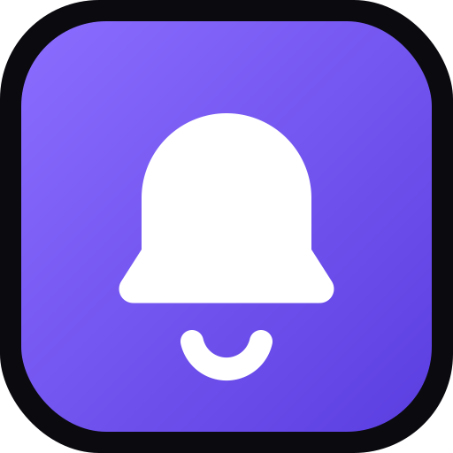

# Agent Dash

**Your agents report here.** A self-hosted push inbox for AI agents — deploy
your own on Cloudflare's free plan, and any agent (Claude Code, Codex, Cursor,
Antigravity, Kimi, or a raw ChatGPT/Claude chat) can send updates to your phone
and **ask you a question and wait for your answer** before continuing.

Think "ntfy for agents, with a reply button." Vendor-neutral, single-user,
free to run.

<p align="center"></p>

---

## Why

Every AI vendor has a companion app — but it only talks to *their* agent. When
you kick off a long research run, a refactor, or a build in Claude Code / Codex
/ Cursor, you either babysit the terminal or miss the moment it finishes or gets
stuck.

Agent Dash is one inbox for **all** of them:

- 🔔 **Push updates** — milestones and completions land as notifications on your phone (installable PWA, works on iOS + Android).
- ❓ **Ask-and-wait** — an agent can post a question (a choice, or a whole form) and poll until you answer, then continue. *"I finished the research — VC or customer framing for the deck?"* → you tap → it keeps going.
- 🧱 **Structured messages** — agents send typed blocks (markdown, progress bars, tables, forms), not raw text. Rendered safely, never as HTML.
- 🔌 **Connect anything** — a portable [skill](skills/agent-dash/SKILL.md), a one-line [MCP](#connect-an-agent) server, an OpenAPI spec for ChatGPT Actions, and drop-in [Claude Code hooks](examples/claude-code-hooks).
- 🆓 **Free to host** — one Cloudflare Worker + D1 + KV. No Durable Objects, no Postgres, no Firebase. Fits comfortably in the free tier for one person.

## Deploy your own (≈5 minutes)

You need a free [Cloudflare account](https://dash.cloudflare.com/sign-up) and
Node 20+.

```bash
git clone https://github.com/Prajeevan/agent-dash.git
cd agent-dash
pnpm install          # or npm install
npx wrangler login    # authorize wrangler with your Cloudflare account

# Create the database + KV, then wire their ids into wrangler.jsonc:
npx wrangler d1 create agent-dash
npx wrangler kv namespace create SESSIONS
#  → paste the printed database_id and id into wrangler.jsonc

pnpm setup            # generates keys, sets secrets, migrates DB, deploys
```

`pnpm setup` prints your **worker URL**, a **magic login link**, and your
**agent connection snippet**. Then:

1. **Scan the QR code** it prints with your phone (or open the link) → **Add to Home Screen** → open the app → **Settings → Enable notifications**.
2. Give an agent the MCP snippet or the [skill](skills/agent-dash/SKILL.md).

Re-run `pnpm run login` any time for a fresh 15-minute login link + QR (rendered
locally in your terminal — the magic-link token never leaves your machine). Re-run
`pnpm setup --rotate` to regenerate all keys.

## Connect an agent

**MCP** (Claude Code, Cursor, Codex, any MCP client) — one entry:

```json
{
  "mcpServers": {
    "agent-dash": {
      "url": "https://agent-dash.your-name.workers.dev/mcp",
      "headers": { "Authorization": "Bearer YOUR_AGENT_KEY" }
    }
  }
}
```

Tools: `notify(title, blocks?, priority?)`, `ask(title, blocks)`, `wait_for_answer(question_id)`.

**Skill** — install it into any Agent-Skills runtime (Claude Code, Cursor,
Codex, …) straight from GitHub:

```bash
npx skills add Prajeevan/agent-dash
```

This drops `skills/agent-dash/SKILL.md` into your agent so it knows how to reach
your hub; then give it your URL + `AGENT_KEY`.

**curl** (anything that can make an HTTP request, including a raw chat) — the one-liner:

```bash
curl -X POST "$AGENT_DASH_URL/api/v1/events" \
  -H "Authorization: Bearer $AGENT_KEY" -H "Content-Type: application/json" \
  -d '{"agent":"claude","title":"Build finished","priority":1}'
```

**ChatGPT Actions** — import `https://your-url/api/v1/openapi.json`.

**Claude Code hooks** — [drop-in start/finish/needs-input pushes](examples/claude-code-hooks).

## How it works

```
Agents ──POST /api/v1/events─────▶  Cloudflare Worker (TanStack Start SSR + API)
       ──POST /api/v1/questions──▶    ├─ /api/v1/*   agent REST  (bearer AGENT_KEY)
       ◀─GET  /api/v1/questions/:id   ├─ /mcp        stateless MCP
                                      ├─ /app        dashboard PWA (magic-link session)
You (PWA) ◀── Web Push (VAPID) ───    └─ Bindings: D1 (events/questions/subs), KV (sessions)
          ──poll feed while open─▶    Cron: expire questions + prune old events
```

- **No Durable Objects.** Delivery is Web Push (real-time, free) plus polling —
  agents check for answers every ~10s; the dashboard polls a cursor feed only
  while a tab is open. A single-user workload stays well inside free limits.
- **Two credentials, separate concerns.** `AGENT_KEY` (agents post/poll) and
  `APP_SECRET` (signs your magic-login links + sessions). They rotate
  independently. Sessions live in KV with a TTL; "log out everywhere" bumps an
  epoch that invalidates them all.
- **Blocks, not HTML.** Agent messages are `zod`-validated typed blocks; the UI
  renders a known set — no agent-supplied markup is ever executed.

See [`PLAN.md`](PLAN.md) for the full design rationale.

## Tech

TanStack Start (React 19) on Cloudflare Workers · D1 · KV · Web Push (hand-rolled
VAPID + RFC 8291 on WebCrypto, no Node deps) · Vite · TypeScript.

Dev: `pnpm dev`. Typecheck: `pnpm typecheck`. Deploy: `pnpm run deploy`.

## Roadmap

- [ ] Optional "instant mode": one hibernating Durable Object for sub-second delivery without polling (still free-tier compatible).
- [ ] Capacitor shell for native app-store builds where PWA push is inconvenient.
- [ ] More block types (charts, diffs) — PRs welcome (raw-HTML blocks will be declined by design).

## License

MIT — see [LICENSE](LICENSE). The single-user core stays MIT forever.
